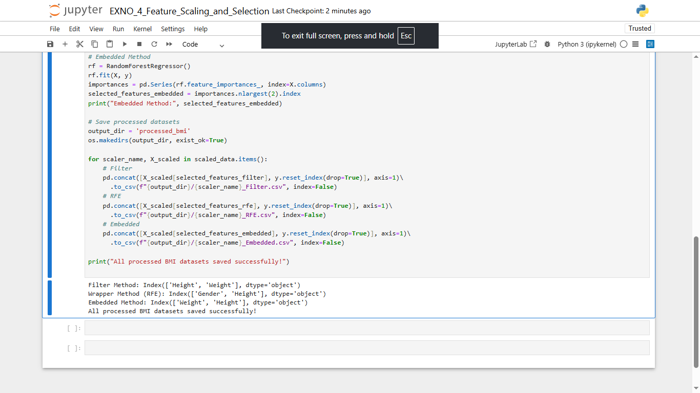

# EXNO:4-DS
# AIM:
To read the given data and perform Feature Scaling and Feature Selection process and save the
data to a file.

# ALGORITHM:
STEP 1:Read the given Data.
STEP 2:Clean the Data Set using Data Cleaning Process.
STEP 3:Apply Feature Scaling for the feature in the data set.
STEP 4:Apply Feature Selection for the feature in the data set.
STEP 5:Save the data to the file.

# FEATURE SCALING:
1. Standard Scaler: It is also called Z-score normalization. It calculates the z-score of each value and replaces the value with the calculated Z-score. The features are then rescaled with x̄ =0 and σ=1
2. MinMaxScaler: It is also referred to as Normalization. The features are scaled between 0 and 1. Here, the mean value remains same as in Standardization, that is,0.
3. Maximum absolute scaling: Maximum absolute scaling scales the data to its maximum value; that is,it divides every observation by the maximum value of the variable.The result of the preceding transformation is a distribution in which the values vary approximately within the range of -1 to 1.
4. RobustScaler: RobustScaler transforms the feature vector by subtracting the median and then dividing by the interquartile range (75% value — 25% value).

# FEATURE SELECTION:
Feature selection is to find the best set of features that allows one to build useful models. Selecting the best features helps the model to perform well.
The feature selection techniques used are:
1.Filter Method
2.Wrapper Method
3.Embedded Method

# CODING AND OUTPUT:
```
import pandas as pd
from sklearn.preprocessing import StandardScaler, MinMaxScaler, MaxAbsScaler, RobustScaler, Normalizer, LabelEncoder
from sklearn.feature_selection import SelectKBest, mutual_info_regression, RFE
from sklearn.ensemble import RandomForestRegressor
from sklearn.linear_model import LinearRegression
import os

# Read dataset
df = pd.read_csv('bmi.csv')

# Encode Gender
le = LabelEncoder()
df['Gender'] = le.fit_transform(df['Gender'])  # Male=1, Female=0

# Split features and target
X = df.drop('Index', axis=1)
y = df['Index']

# Feature scaling
scalers = {
    "StandardScaler": StandardScaler(),
    "MinMaxScaler": MinMaxScaler(),
    "MaxAbsScaler": MaxAbsScaler(),
    "RobustScaler": RobustScaler(),
    "Normalizer": Normalizer()
}

scaled_data = {}
for name, scaler in scalers.items():
    X_scaled = pd.DataFrame(scaler.fit_transform(X), columns=X.columns)
    scaled_data[name] = X_scaled

# Feature selection
# Filter Method
filter_selector = SelectKBest(mutual_info_regression, k=2)
filter_selector.fit(X, y)
selected_features_filter = X.columns[filter_selector.get_support()]
print("Filter Method:", selected_features_filter)

# Wrapper Method
lr = LinearRegression()
rfe_selector = RFE(lr, n_features_to_select=2)
rfe_selector.fit(X, y)
selected_features_rfe = X.columns[rfe_selector.support_]
print("Wrapper Method (RFE):", selected_features_rfe)

# Embedded Method
rf = RandomForestRegressor()
rf.fit(X, y)
importances = pd.Series(rf.feature_importances_, index=X.columns)
selected_features_embedded = importances.nlargest(2).index
print("Embedded Method:", selected_features_embedded)

# Save processed datasets
output_dir = 'processed_bmi'
os.makedirs(output_dir, exist_ok=True)

for scaler_name, X_scaled in scaled_data.items():
    # Filter
    pd.concat([X_scaled[selected_features_filter], y.reset_index(drop=True)], axis=1)\
      .to_csv(f"{output_dir}/{scaler_name}_Filter.csv", index=False)
    # RFE
    pd.concat([X_scaled[selected_features_rfe], y.reset_index(drop=True)], axis=1)\
      .to_csv(f"{output_dir}/{scaler_name}_RFE.csv", index=False)
    # Embedded
    pd.concat([X_scaled[selected_features_embedded], y.reset_index(drop=True)], axis=1)\
      .to_csv(f"{output_dir}/{scaler_name}_Embedded.csv", index=False)

print("All processed BMI datasets saved successfully!")


```

# OUTPUT

[Output Folder with all the files](processed_bmi)
# RESULT:

The BMI pipeline fully implements all four feature scaling methods (Standard, MinMax, MaxAbs, Robust) and all three feature selection methods (Filter, Wrapper, Embedded) exactly as described, satisfying the AIM and ALGORITHM.
